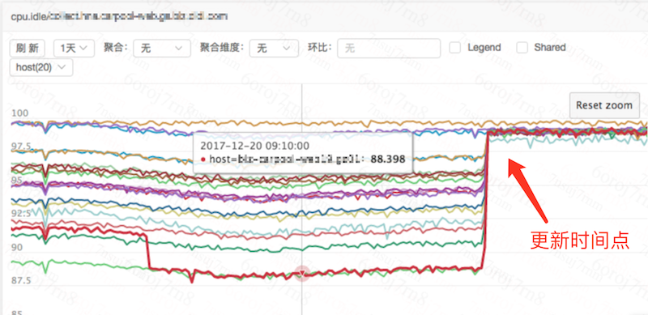

# falcon-log-agent 


# 目录
- [简介](#简介)
- [Feature](#Feature)
- [什么是日志采集](#什么是日志采集)
- [falcon-log-agent如何工作](#falcon-log-agent如何工作)
- [限定条件](#限定条件)
- [开始使用log-agent](#开始使用log-agent)
  * [构建](#)
  * [修改配置文件](#)
  * [启动/停止服务](#)
- [基础配置项](#基础配置项)
  * [日志相关](#)
  * [worker相关](#)
  * [资源限制](#)
  * [策略相关](#)
  * [其他](#)
- [采集策略](#采集策略)
  * [文件路径](#文件路径)
  * [时间格式](#时间格式)
  * [采集规则](#采集规则)
  * [采集周期](#采集周期)
  * [采集方式](#采集方式)
  * [采集名称](#采集名称)
  * [标签](#标签)
  * [其他](#其他)
- [自身状态暴露](#自身状态暴露)
- [自监控](#自监控)

# 简介
falcon-log-agent是一个开源版的日志采集工具，旨在从流式的日志中抓取、统计日志中的特征信息。

获取的特征信息，与开源版Open-Falcon监控系统打通。可用于业务指标的衡量、也可用于稳定性的建设。

# Feature
- **准确可依赖**：历经滴滴线上业务近一年考验，统计准确性高。
- **性能高、资源消耗可控**：性能优化程度高，单核单策略可支撑日志分析:20W条/秒
- **接入成本低**：外挂式采集，只需要标准化日志即可；输出数据直接对接open-falcon。

附：我司agent升级前后资源占用对比图



# 什么是日志采集
日志采集，是一种外挂式的采集。通过读取进程打印的日志，来进行监控数据的采集与汇聚计算。

# falcon-log-agent如何工作
本agent即日志采集场景下的实时计算。实时读取文件内容，实时计算，将计算结果直接推送至falcon。

# 限定条件
- **要求日志必须包含时间**：不包含时间的日志，只能根据当前时间统计日志条数，结果非常不准确。
- **不支持文件软链**
- **日志时间必须有序**：为了应对日志延迟落盘等，agent会根据日志的时间来判断某一周期的数据是否采集完成，如果日志时间顺序错乱，可能导致采集不准。

# 开始使用log-agent

**构建**
```
go get https://github.com/didi/falcon-log-agent.git && cd $GOPATH:/src/github.com/didi/falcon-log-agent
make build
```

**修改配置文件**
```
# base config
cp cfg/dev.cfg cfg/cfg.json
vim cfg/cfg.json

# strategy config
cp cfg/strategy.dev.json cfg/strategy.json
vim cfg/strategy.json
```

**打包 & 安装**
```
make pack
export WorkDir="$HOME/falcon-log-agent"
mkdir -p $WorkDir
tar -xzvf falcon-log-agent.tar.gz -C $WorkDir
cd $WorkDir
```


**启动/停止服务**
```
 # start
./control start

# stop
./control stop

# status
./control status
```

# 基础配置项
基础配置项，即程序本身的配置项。默认是cfg/cfg.json，可以通过-c参数来指定。

**日志相关**
```
log_path：程序输出的日志目录
log_level：日志等级
log_rotate_size：日志切割大小
log_rotate_num：按配置切割之后，保留多少个文件，其他的清理掉
```

**worker相关**
```
worker_num：每个日志文件，进行计算的并发数
queue_size：读文件和进行计算之间，有一个缓冲队列，如果队列满了，意味着计算能力跟不上，就要丢日志了。这个配置就是这个缓冲队列的大小。
push_interval：循环判断将计算完成的数据推送至发送队列的时间
push_url：推送的odin-agent的url
```

**资源限制**
```
max_cpu_rate:最大使用的cpu百分比。（可用核数=ceil(总核数*max_cpu_rate))
max_mem_rate:最打使用内存百分比。(最大内存=(内存总大小*max_mem_rate)，最小为500M)
```

**策略相关**
```
update_duration:策略的更新周期
default_degree:默认的采集精度
```

**其他**
```
http_port:自身状态对外暴露的接口
```

# 采集策略

## 文件路径

文件路径，即file_path配置项。**必须要求启动agent的用户，对这个文件有可读权限**。

文件路径支持固定路径和动态路径两种：
- 固定路径：直接填写即可，如/var/log/falcon-log-agent.log
- 动态路径：可支持按照规则配置的根据时间变化的路径。例如：

```
比如：线上有些模块自己按照小时写入文件，路径为：
/xiaoju/application/log/20150723/application.log.2015072312
 
对应的我们的配置方式可以填写为：
/xiaoju/application/log/${%Y%m%d}/application.log.${%Y%m%d%H}    //  ${}中不能包含/
```

## 时间格式

时间格式，即time_format配置项。

如果日志中没有时间格式，一旦遇到日志延迟落盘、或者日志量太大计算延迟的情况。会直接导致我们的监控采集不准。

因此，我们规定日志中必须有合法的时间格式。且在配置中time_format项指定。

如果想要添加自己的时间格式，可以直接在[common/utils/util.go](https://github.com/didi/falcon-log-agent/blob/master/src/common/utils/util.go)里添加。

目前已经支持的时间格式如下：
```
dd/mmm/yyyy:HH:MM:SS
dd/mmm/yyyy HH:MM:SS
yyyy-mm-ddTHH:MM:SS
dd-mmm-yyyy HH:MM:SS
yyyy-mm-dd HH:MM:SS
yyyy/mm/dd HH:MM:SS
yyyymmdd HH:MM:SS
mmm dd HH:MM:SS

PS：为了防止日志积压或性能不足导致的计算偏差，日志采集的计算，依赖于日志的时间戳。
因此如果配置了错误的时间格式，将无法得到正确的结果。
```

## 采集规则

采集正则，包含两个配置项：pattern和exclude。

两个采集项都是正则表达式，正则表达式的支持情况见：[google/re2](https://github.com/google/re2/wiki/Syntax)

pattern代表需要完全匹配出来的表达式。

exclude代表需要排除掉的表达式。

```
eg. 例如，我希望统计code=500或400的日志数量，但是想排除掉关键字SpeciallyErrorNo。 配置如下：

pattern: code=[45]00
exclude: SpeciallyErrorNo
```

## 采集周期

采集周期(step)，对应着监控系统的上报周期。意味着多久合并上报一次。
```
假设每秒产生1条符合采集规则的日志，配置的采集方式为计数。
如果step为10 : 则每10s上报一次，值为10
如果step为60 : 则每60s上报一次，值为60
```

## 采集方式

采集方式(func)的意思是，当我们从日志中筛选出一堆符合规则的日志之后，应该以哪种规则来计算拿到最后的值来上报。

目前支持的采集方式有：
- cnt
- avg
- sum
- max
- min

举例：
```
假设：
正则表达式配置为 Return Success : (\d+)s Used
 
某一个周期内日志滚动：
2017/12/01 12:12:01 Return Success : 1s Used
2017/12/01 12:12:02 Return Success : 2s Used
2017/12/01 12:12:03 Return Success : 4s Used
2017/12/01 12:12:04 Return Success : 2s Used
2017/12/01 12:12:05 Return Success : 1s Used
 
首先，根据正则获取到括号内的值：1、2、4、2、1
接下来，根据不同的计算方式，会得到不同的结果：
avg   : (1 + 2 + 4 + 2 + 1) / 5 = 2
count : 5
sum   : (1 + 2 + 4 + 2 + 1) = 10
max   : Max(1, 2, 4, 2, 1) = 4
min   : Min(1, 2, 4, 2, 1) = 1
```

## 采集名称

**采集名称**(name)对应open-falcon中的metric，即监控项。

## 标签

**标签**(tags)与open-falcon中的tags相对应。可以理解为确定监控项的补充。
```
说明：机器A的第一个核的cpu空闲率。

采集名称(metric): cpu空闲率(cpu.idle)
标签(tags)：两个标签: host=机器A;核数=第一个核
```
在主正则匹配完成后，然后匹配出tag的值，一起进行上报。

若无法匹配出tag的值，则视为该条数据未匹配到，该条日志将**不再计入统计**。

## 其他

- degree: 精度
- comment: 备注


# 自身状态暴露
falcon-log-agent本身对外提供了一个http服务用来暴露自身状态。

主要提供的url如下：
- /health  ： 自身存活状态
- /strategy ：当前生效的策略列表
- /cached ： 最近1min内上报的点


# 自监控
在[common/proc/metric/metric.go](https://github.com/didi/falcon-log-agent/blob/master/src/common/proc/metric/metric.go#L39)定义了一个自监控结构体。

在程序运行过程中会不断收集信息，主要包括如下：
```
MemUsedMB       进程内存占用
ReadLineCnt     读日志行数
DropLineCnt     队列打满后，扔掉的日志行数
AnalysisCnt     分析完成的日志行数
AnalysisSuccCnt 分析成功匹配的日志行数
PushCnt         推送的监控数据点数
PushErrorCnt    推送错误的监控数据点数
PushLatency     推送监控数据延迟
```
这些数据，目前自监控的处理方式是：定时输出日志。

如果需要对接自己公司的监控系统，在[common/proc/metric/metric.go](https://github.com/didi/falcon-log-agent/blob/master/src/common/proc/metric/metric.go#L82)修改HandleMetrics方法即可。
